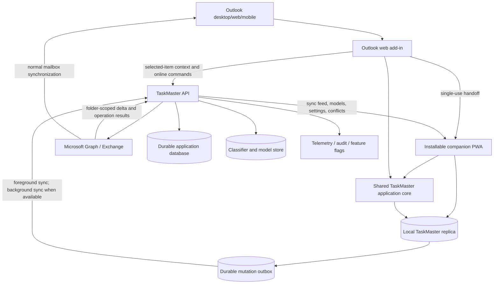

# TaskMaster Migration to a Modern Supported Architecture

## Purpose and decision status

This document is the top-level pre-planning record for migrating TaskMaster from its current VSTO/.NET Framework architecture to a supported, cross-platform architecture.

The recommended target is a **three-part product**:

1. an **Outlook web add-in** for contextual actions on the message currently open or selected in Outlook;
2. an **installable, local-first companion PWA** that is the full offline TaskMaster client on desktop and mobile; and
3. an **ASP.NET Core service and Microsoft Graph data plane** for authoritative mailbox writes, durable application state, model synchronization, automation, audit, and operations.

The companion PWA is not merely a queue, diagnostics page, or secondary task viewer. It is the application that preserves TaskMaster workflows when the Outlook-hosted add-in cannot run, including offline use against a synchronized local replica.

TaskMaster VSTO remains available only as a temporary migration reference and rollout fallback. It is not a target-state dependency.

## Executive summary

TaskMaster is currently a Windows-only Outlook VSTO add-in targeting .NET Framework 4.8.1. Its functional surface includes Quick Filer, folder prediction and search, attachment and message export, undo behavior, SpamBayes, triage training, tags, task and project views, task-tree operations, diagnostics, store controls, and Outlook-host lifecycle behavior.

The current TMW repository is a valuable modern starting point. It already demonstrates an Office.js Outlook add-in, TypeScript client code, a layered ASP.NET Core API, Microsoft identity integration, Microsoft Graph access, an iFile flow, OpenAPI, quality gates, and an Outlook Mobile presentation. It remains an incomplete successor: broader TaskMaster parity, production persistence, a scoped mailbox replica, a local classifier strategy, an outbox/synchronization engine, conflict handling, production telemetry, feature flags, deployment infrastructure, and a full companion PWA are not yet complete.

The migration should preserve **user outcomes**, not VSTO, COM, WinForms, OST, or Ribbon implementation mechanics. The strongest supported outcome is:

> A user can perform supported TaskMaster workflows against synchronized data while offline, see durable local results immediately, close and restart the application without losing work, and have those actions applied exactly once to the authoritative mailbox after connectivity returns.

The target does not attempt to modify Outlook's private native offline cache directly. No supported Office.js or Microsoft Graph API provides that capability. Instead, the PWA maintains its own TaskMaster replica and optimistic projection. Exchange is updated after reconnection through the TaskMaster API and Graph, and Outlook converges through its normal mailbox synchronization.

## Verified platform constraints

These constraints must be treated as architectural inputs rather than implementation surprises.

### VSTO and COM

VSTO and COM add-ins are not supported in the new Outlook for Windows. They remain supported in classic Outlook for Windows. The supported Outlook-integrated replacement surface is an Outlook web add-in.

Reference: [Develop Outlook add-ins for the new Outlook on Windows](https://learn.microsoft.com/en-us/office/dev/add-ins/outlook/one-outlook).

### Outlook add-ins while offline

In the new Outlook for Windows, installed task-pane and function-command add-ins do not run while Outlook is offline. If Outlook launches offline, they do not appear. If connectivity is lost during a session, installed add-ins do not run again until connectivity is restored.

This limits the Outlook-hosted surface. It does **not** prevent an independently installed PWA from running offline.

Reference: [Add-in availability when offline](https://learn.microsoft.com/en-us/office/dev/add-ins/outlook/one-outlook#add-in-availability-when-offline).

### Outlook Mobile

Outlook Mobile supports deliberately scoped add-in scenarios, generally centered on Message Read mode. The mobile task pane occupies the full screen and should support short, high-value actions. Current Microsoft guidance states that add-ins using the unified Microsoft 365 manifest are not installable in Outlook Mobile; a maintained add-in-only manifest with a mobile form factor is required.

References:

- [Add-ins for Outlook on mobile devices](https://learn.microsoft.com/en-us/office/dev/add-ins/outlook/outlook-mobile-addins)
- [Add support for add-in commands in Outlook on mobile devices](https://learn.microsoft.com/en-us/office/dev/add-ins/outlook/add-mobile-support)

### PWA offline storage

A PWA can cache its application shell and web resources through a service worker and the Cache API. IndexedDB is intended for larger amounts of structured client data and can be used by the front end and service worker. Browser storage is quota-controlled and may be evicted unless persistence is granted, so storage health and recovery must be explicit product behaviors.

Reference: [Store data on the device](https://learn.microsoft.com/en-us/microsoft-edge/progressive-web-apps/how-to/offline).

### Mailbox replica synchronization

Microsoft Graph message delta queries are designed to maintain and incrementally synchronize a local message store. Delta tracking is folder-scoped, so the design must retain and manage a cursor for every synchronized folder.

Reference: [Get incremental changes to messages in a folder](https://learn.microsoft.com/en-us/graph/delta-query-messages).

## Current-state summary

### TaskMaster

The legacy solution contains a VSTO host plus multiple supporting projects, including:

- TaskMaster;
- QuickFiler;
- UtilitiesCS;
- ToDoModel;
- Tags;
- TaskTree;
- TaskVisualization;
- SVGControl;
- related MSTest projects.

The legacy Ribbon exposes filing, search, undo, classifier, training, settings, tagging, task, diagnostics, and administrative workflows. Important behavior is distributed across UI callbacks, Outlook event handlers, COM-bound helpers, local files, application settings, classifier state, and global runtime services.

Step 1 must turn those behaviors into explicit feature contracts and characterization scenarios before the target implementation is treated as parity-complete.

### TMW

TMW already contains:

- an Office.js task-pane and command surface;
- TypeScript host-neutral modules and host wiring;
- a mobile add-in-only manifest and a mobile task-pane path;
- a layered modern .NET solution;
- an authenticated API;
- Microsoft Identity Web and Microsoft Graph integration;
- correlation middleware and OpenAPI;
- classification and feedback endpoint scaffolding;
- an iFile workflow with server-side attachment handling and message moves;
- TypeScript and .NET quality gates.

TMW should be evolved rather than discarded. Existing pieces must be audited as `retain`, `harden`, `replace`, `prototype-only`, or `remove`; names and scaffolds must not be mistaken for parity.

## Target architecture



### Outlook add-in responsibilities

The Outlook add-in owns contextual Outlook integration:

- identify the selected or opened item through Office.js;
- render concise online actions;
- acquire or broker an API credential;
- display current TaskMaster status when online;
- invoke online commands;
- create a short-lived handoff to the companion PWA;
- request that a message or conversation be included in the PWA's offline scope;
- expose clear host capability and connectivity states.

The add-in should remain thin. It must not own the durable mailbox replica, classifier state, sync queue, conflict engine, or production Graph mutation logic.

### Companion PWA responsibilities

The companion PWA is the primary TaskMaster application outside the Outlook host and the full offline client. It owns:

- independent installation and launch;
- service-worker application-shell caching;
- the scoped local message, folder, task, tag, settings, and model replica;
- local folder and message search;
- local recommendation and classification where the selected classifier permits portable inference;
- local task, tag, and preference workflows;
- optimistic application of mailbox-affecting actions to the TaskMaster projection;
- a durable outbox;
- restart-safe pending operations;
- undo or cancellation before synchronization where the operation permits it;
- sync progress, pending-state, failure, and conflict UX;
- desktop and mobile responsive experiences;
- offline-readiness and storage-health diagnostics.

### Backend and Graph responsibilities

The backend is the durable authority for TaskMaster application state and the only product component that performs privileged Microsoft Graph operations. It owns:

- authentication and authorization;
- Graph on-behalf-of or other approved delegated access;
- task-oriented, versioned APIs;
- idempotent command processing;
- durable operation status;
- mailbox write execution;
- folder and message synchronization feeds;
- Graph subscriptions and delta reconciliation;
- classifier consolidation, training history, and model distribution;
- user settings and TaskMaster metadata;
- feature flags;
- structured logging, traces, metrics, audit, and support diagnostics.

Microsoft 365 remains authoritative for mailbox state. The PWA is authoritative only for unsynchronized local intent and the optimistic TaskMaster projection.

## Definition of strong offline parity

Strong offline parity is not limited to placing opaque commands into a queue. For previously synchronized data, the companion PWA should support most TaskMaster decision-making and workflow logic locally.

### Fully local offline capabilities

Subject to Step 1 parity decisions and cache policy, the PWA should be able to:

- launch and navigate;
- browse synchronized messages and folder hierarchy;
- search cached messages and folders;
- display recent and predicted destinations;
- run local triage, spam/ham, or folder inference where a portable model exists;
- browse and edit TaskMaster tasks and tags;
- record classifier feedback;
- edit preferences;
- review pending operations;
- undo unsynchronized operations;
- review conflicts already detected;
- export locally cached diagnostics.

### Locally completed, remotely committed capabilities

Mailbox-affecting actions should update the PWA projection immediately and then synchronize:

- move or file a message;
- apply or remove mailbox categories;
- archive or delete when approved;
- submit training feedback;
- update server-backed settings;
- create or update TaskMaster metadata;
- upload or export an attachment when its bytes are locally available;
- queue a cloud attachment export when bytes are not locally available.

Each action must clearly distinguish `locally applied`, `pending synchronization`, `server committed`, `conflicted`, and `failed`.

### Explicit limitation

While fully disconnected, the PWA cannot rewrite Outlook's own OST or other Outlook-managed native cache. Outlook may temporarily show the last server-confirmed location while the PWA shows the locally projected destination. After reconnection:

1. the PWA submits the operation;
2. the API applies it exactly once through Graph;
3. the PWA reconciles the operation and delta state; and
4. Outlook independently synchronizes and displays the server result.

This temporary divergence is a supported state and must be visible in the PWA.

## Local replica design

The local data model should include at least:

- Account;
- Mailbox;
- Folder;
- CachedMessage;
- CachedAttachmentMetadata;
- TaskMasterTag;
- TaskMetadata;
- UserSettings;
- ModelSnapshot;
- PendingOperation;
- OperationAttempt;
- SyncCursor;
- Conflict;
- FeatureFlagSnapshot;
- TelemetryEnvelope;
- SchemaMetadata.

All local records must be partitioned by tenant, user, and mailbox. Access tokens and client secrets must not be stored in the domain database.

### Cache tiers

A practical mobile and desktop cache policy should distinguish:

| Tier | Examples |
|---|---|
| Always cached within selected scope | identities, subject, sender display, dates, folder, categories, flags, classification, task/tag metadata |
| Policy controlled | body preview, normalized classifier text, selected headers |
| User selected | full message bodies, conversations, attachments |
| Not cached by default | large attachments, protected content, content outside retention policy |

The PWA must expose cache scope, last synchronization, storage use, persistence status, and pending-operation health.

## Mutation outbox and synchronization

A pending operation should carry:

- stable operation identifier;
- stable idempotency key;
- account and mailbox partition;
- operation type;
- normalized payload;
- expected server version or precondition where available;
- creation time;
- retry state;
- last error;
- current lifecycle state.

Minimum lifecycle:

```text
pending
  -> sending
  -> acknowledged
  -> completed

pending/sending
  -> retryable-failure
  -> pending

pending/sending
  -> conflict

pending/sending
  -> permanent-failure

pending
  -> cancelled
```

Required guarantees:

- atomic creation of the operation and optimistic projection;
- survival of browser, application, and device restart;
- deterministic replay order;
- bounded retry;
- idempotent server handling;
- no duplicate side effects after an ambiguous response;
- per-folder delta reconciliation;
- explicit conflict records;
- server acknowledgement before outbox deletion;
- foreground synchronization as the correctness path;
- background synchronization only as an optimization.

Conflict rules must be operation-specific. A message already at the intended destination may be treated as success; a message moved elsewhere should normally produce a conflict. Tag, task, and settings merges require documented field-level rules. Attachment exports require deduplication.

## Outlook add-in to PWA handoff

The add-in and PWA must use an explicit handoff protocol. They must not rely on sharing browser storage.

Recommended sequence:

1. The add-in reads the selected-item context while online.
2. It sends a normalized reference to `POST /api/v1/handoffs`.
3. The API creates a short-lived, single-use handoff token.
4. The add-in opens an HTTPS TaskMaster application link containing only the opaque token.
5. The installed PWA opens, or the browser PWA opens as fallback.
6. The PWA redeems the token.
7. The PWA stores the normalized message and requested workflow locally.
8. The token expires and cannot be replayed.

Do not place subjects, addresses, access tokens, tenant identifiers, or message bodies in the URL.

The add-in should expose actions such as:

- Open in TaskMaster;
- Save for offline;
- Add to work queue;
- File in TaskMaster;
- Create task from message;
- Classify in TaskMaster.

## Mobile architecture

Mobile has two cooperating surfaces.

### Outlook Mobile add-in

The Outlook Mobile add-in is a short, contextual online entry point. It should:

- show selected-message context;
- expose a few fast actions;
- show current TaskMaster status;
- save or hand off the item to the companion;
- open the companion PWA;
- close cleanly after the action.

It must use capability checks and an add-in-only mobile manifest. It should not attempt to host the complete offline application.

### Installed mobile PWA

The PWA opens independently from the home screen and should provide:

- Work Queue;
- Cached Messages;
- Pending Sync;
- Conflicts;
- Tasks;
- Tags;
- Folders;
- Classifier Feedback;
- Settings and Offline Readiness.

On mobile, correctness must depend on foreground synchronization when the PWA launches, resumes, regains connectivity, or receives a manual `Sync now` action. Background synchronization and push-triggered refresh may improve latency but must not be required for correctness.

Browser storage may be evicted. The PWA must request persistent storage, report whether it was granted, protect and validate the outbox, and make all server-derived cache data reconstructable.

If future product requirements demand storage guarantees stronger than supported PWA storage on a target platform, the same shared application core may later be packaged in a native shell. That is a companion-client packaging decision and does not reintroduce Outlook COM.

## Component-to-target mapping

| Legacy area | Target |
|---|---|
| VSTO host and Ribbon | Outlook web add-in commands and task pane |
| Quick Filer | Shared filing application module used by add-in and PWA |
| Folder search and prediction | Local folder index and portable ranking/inference, synchronized from backend |
| Message and conversation actions | Durable task-oriented API commands with idempotency and conflict rules |
| SpamBayes and triage | Portable local inference where feasible plus server-side model consolidation and training history |
| Tags | Shared domain service, local replica, PWA/mobile UI, mailbox category adapter where appropriate |
| Task visualization and task tree | Companion PWA dashboards and hierarchy editors |
| ToDoModel and user-defined fields | Versioned TaskMaster domain metadata and projections |
| File-backed settings/model state | Durable backend state plus versioned local snapshots |
| Outlook event processing | Graph subscriptions, delta reconciliation, and foreground client sync |
| log4net and startup diagnostics | Structured client/server observability and support diagnostics |
| Disabled-store and resilience tools | Explicit account/mailbox scope, health, circuit breaking, and administrative controls |

## Migration sequence

### Step 1 — discovery and parity definition

Step 1 produces:

- verified legacy behavior contracts;
- TaskMaster component coverage;
- runtime characterization;
- unspecified-behavior decisions;
- target parity matrix;
- online, offline, reconnect, desktop, and mobile requirements;
- acceptance scenarios;
- pinned TaskMaster and TMW baselines.

No platform implementation should begin from floating or unverified contracts.

### Step 2 — platform foundation

Step 2 establishes the platform and proves one TaskMaster-derived vertical slice. It includes:

- shared application and host boundaries;
- Outlook add-in shell;
- installable companion PWA shell and service worker;
- authentication;
- versioned API;
- production persistence abstractions;
- local replica scaffolding;
- outbox and synchronization contracts;
- telemetry;
- feature flags;
- environment and deployment skeleton;
- TaskMaster oracle fixtures;
- an online/offline/reconnect/mobile vertical slice.

Step 2 is detailed in `step 02`.

### Later feature waves

After the foundation proof:

1. iFile and folder-workflow parity;
2. local-first offline expansion;
3. tags and task projections;
4. triage, SpamBayes, and model migration;
5. analytics and administrative tools;
6. controlled rollout and VSTO retirement.

## Step 2 vertical-slice gate

Step 2 is not complete when separate scaffolds merely compile. The selected TaskMaster-derived workflow must prove:

1. The Outlook add-in launches and authenticates online.
2. It passes selected-message context to the installed PWA through a single-use handoff.
3. The PWA installs and launches without connectivity.
4. A scoped set of messages and folders is available locally.
5. Local folder search works.
6. At least one local recommendation or classifier path works.
7. The user completes a filing action while offline.
8. The optimistic projection and pending operation are committed atomically.
9. The result survives application and device restart.
10. The user can inspect and, where allowed, undo the pending action.
11. Reconnection triggers synchronization.
12. The API applies the operation exactly once.
13. Delta reconciliation advances the local replica.
14. Conflicts are visible and deterministic.
15. Outlook displays the result after its own mailbox synchronization.
16. Telemetry links handoff, local action, API command, Graph result, and reconciliation.
17. A feature flag can safely disable the slice.
18. The workflow is verified on desktop PWA and mobile PWA, with the Outlook Mobile add-in verified as the contextual online entry point.

## Rollout

Use side-by-side, feature-scoped rollout:

- keep classic TaskMaster for unmigrated workflows;
- gate target modules by server-side feature flags;
- compare legacy and modern behavior with sanitized evidence and telemetry;
- support cohort rollout;
- make rollback feature-specific;
- do not retire a legacy feature until its approved desktop, offline, reconnect, and mobile acceptance scenarios pass.

TaskMaster is retired only after all legacy-only behaviors are migrated, intentionally changed, or explicitly retired.

## Completion criteria for the migration

The migration is complete when:

- the VSTO add-in is no longer required for core daily workflows;
- the Outlook add-in provides supported contextual integration;
- the companion PWA provides the approved full local-first workflow set;
- mailbox-affecting operations synchronize exactly once;
- local and server state reconcile predictably;
- mobile users can move between Outlook context and the PWA without losing workflow state;
- classifier, tag, task, filing, and settings behavior meets approved contracts;
- production observability, security, deployment, rollback, and support runbooks are operational;
- remaining legacy-only behavior is explicitly accepted or retired.

## Pre-planning document set

Read the documents in `docs/migration/pre-planning` in the order defined by its `README.md`. Step 1 defines the evidence and parity baseline. Step 2 defines the reusable tooling, repository responsibilities, platform implementation sequence, and orchestrator prompts.
