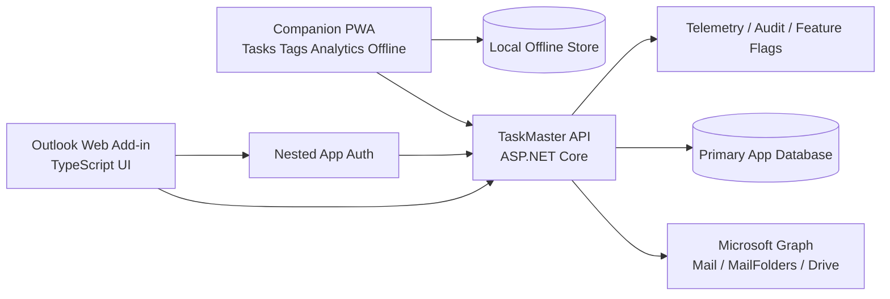
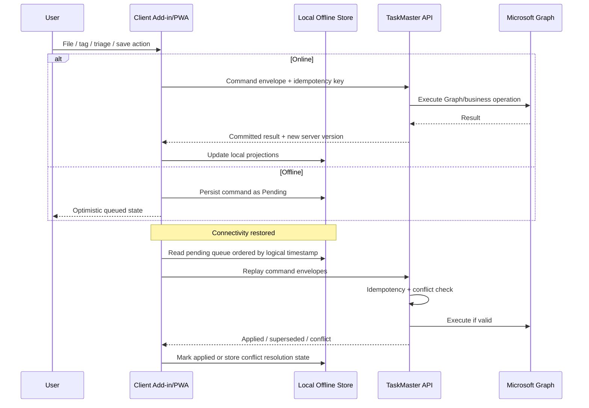

# TaskMaster Migration to a Modern Supported Architecture

## Executive summary

TaskMaster is currently a Windows-only Outlook VSTO add-in on .NET Framework 4.8.1, with a broad feature surface that spans Quick Filer, spam and triage classifiers, tags, task visualization, folder/category prediction, and Outlook-integrated task workflows. Microsoft’s current platform direction is clear: VSTO and COM add-ins are not supported in the new Outlook for Windows, although they remain supported in classic Outlook for Windows. For any architecture meant to survive Microsoft’s client transition, the primary in-context Outlook surface should be an Outlook web add-in, not VSTO. citeturn45view0turn30view4turn43search0turn43search1turn43search5turn43search9

The most practical migration path is **not** a wholesale rewrite into a standalone desktop application. The strongest option is a **hybrid modern architecture** built around an **Outlook web add-in for in-context mail workflows**, an **ASP.NET Core backend for Graph and business logic**, and an **installable companion PWA** for richer cross-platform task, tagging, analytics, and offline-heavy workflows. That approach preserves Outlook context where it matters, aligns with Microsoft’s supported extensibility model, works on new Outlook, Outlook on the web, and Outlook mobile, and gives you a credible path to preserving “offline cached mode” and “mobile mode” without reproducing old COM-era assumptions. citeturn43search0turn43search5turn43search6turn43search14turn43search16turn43search4turn44search6

TMW is a valuable starting point, but it is a **narrow slice**, not yet a successor to TaskMaster. It already proves the most important platform bets: Office add-in packaging, a TypeScript/Office.js front end, an ASP.NET Core API, Microsoft identity integration, a Graph-backed iFile flow, a mobile-specific inlined presentation, and nested app authentication integration. However, it does **not** yet provide parity for the broader TaskMaster feature set: SpamBayes, triage training workflows, tags, task visualization, broader analytics, production-grade persistence, or an explicit offline queue/sync subsystem. Its classifier is currently a simple keyword classifier, feedback persistence is in-memory, and user settings persistence is only a JSON file repository. citeturn13view3turn15view0turn15view1turn16view1turn16view2turn15view3turn22view0turn23view0turn23view1

My recommendation is to execute the migration in **feature-stratified phases**. Start with the **mail filing path** because it is the clearest parity corridor from TaskMaster to TMW. Keep classic TaskMaster running in parallel while you add parity modules to the new stack: first iFile and folder search, then tags and task views, then triage/spam/classifier workflows, then analytics and administrative tools. Preserve continuity through side-by-side deployment, feature flags, dual-run telemetry, and narrowly scoped rollback points. Where the legacy behavior is not fully documented in the repositories, treat it as **unspecified** and make those behaviors explicit in acceptance criteria before implementation. citeturn45view0turn32view0turn32view1turn41view0turn45view1

## Current-state inventory

TaskMaster’s repository describes the product as an Outlook add-in and supporting libraries that “triage, tag, and file email quickly; visualize tasks; and apply ML-assisted classifiers (spam, triage, folder/category predictions)” through the Outlook Ribbon. The solution layout shows a VSTO add-in project plus supporting projects including **QuickFiler**, **Tags**, **TaskTree**, **TaskVisualization**, **ToDoModel**, and **UtilitiesCS**. The VSTO project targets **.NET Framework 4.8.1** and references the VSTO runtime, while also pulling in dependencies such as **Apache Arrow**, **Microsoft.Data.Analysis**, **Microsoft.ML.DataView**, **ObjectListView**, **Newtonsoft.Json**, **log4net**, **System.Reactive**, and related compatibility libraries. citeturn45view0turn26view0turn27view1turn27view2turn27view3turn28view0turn30view4

The Ribbon surface is expansive. It includes **Sort Email**, **Find Folder**, **Undo Sort**, **Quick Filer**, **Quick Filer — High Confidence**, a **High Confidence %** setting, Quick Filer settings for **Move Entire Conversation**, **Save Attachments**, **Save Email Copy**, and **Save Pictures**, and separate menu areas for **Spam Bayes**, **Folder Classifier**, **Bayesian Performance**, and **Triage**. The SpamBayes area exposes training, save/load location controls, junk-folder settings, testing, metrics, and error investigation; the Triage area exposes A/B/C training plus a filter viewer and precision control; and the code behind the ribbon also loads task tree, task visualization, folder settings, disabled stores, and task-flagging workflows. citeturn36view1turn36view2turn36view3turn37view3turn37view4turn37view5turn39view0turn39view1turn39view2turn39view3turn32view0turn32view1

The supporting projects reinforce that TaskMaster is more than an email filing tool. **TaskVisualization** contains controllers and viewers for auto-assigning context and people, auto-creating projects, managing filters, prompting for tags, flag calculations, and task-viewer interfaces. **Tags** contains tag-viewing and auto-assignment interfaces. **UtilitiesCS** contains dialogs, email intelligence modules, OneDrive helpers, Outlook object helpers, threading utilities, and Windows API wrappers. **ThisAddIn.cs** also shows substantial host-bound lifecycle code for startup diagnostics, UI heartbeat, dark mode, logging initialization, and store-lockup detection/disable behavior, which means some resilience and administrative capabilities are embedded deeply in the legacy Outlook-host lifecycle. citeturn45view3turn27view4turn28view0turn30view5turn41view0

TMW’s scope is much narrower but much more modern. The repository uses Office add-in packaging and a web stack, with a **taskpane** front end, **commands** runtime, and a layered ASP.NET Core backend split across **TaskMaster.Api**, **TaskMaster.Application**, **TaskMaster.Classifier**, **TaskMaster.Domain**, and **TaskMaster.Infrastructure**. The current backend exposes `/health`, `/api/ping`, `/api/classify`, `/api/classify/feedback`, `/api/ifile/folders`, and `/api/ifile/file`. The front-end iFile controller loads the leaf-folder list once per container open and then filters it entirely in memory on each keystroke. citeturn7view0turn18view0turn19view0turn19view1turn19view2turn13view3turn15view0turn16view0

TMW already contains a credible mail-filing data flow. The client requests the leaf-folder list and posts a file command containing the **message REST id**, **destination folder id**, and optional **Archive root drive item id**. The backend then resolves or persists the archive-root mapping, mirrors the Outlook folder path into OneDrive, uploads **non-inline file attachments**, and only then moves the message. The Graph move behavior itself is important: Microsoft Graph’s move endpoint creates a **new copy** of the message in the destination folder and removes the original. That behavior should directly inform the idempotency and conflict design of the migrated system. citeturn15view1turn13view3turn22view2turn22view3turn22view4turn43search3

TMW also clearly includes **mobile-aware design**, but in a constrained sense. On Outlook mobile, the same iFile bundle switches from dialog presentation to an **inline full-screen task pane**, and the message ID resolver returns `item.itemId` unchanged because `convertToRestId` is not available on that host. The mobile guidance in the README is explicitly centered on **Outlook Mobile (iOS)** with public HTTPS hosting and Dev Tunnels, and the add-in is sideloaded through Outlook on the web before syncing to the Outlook app on the iPhone. That proves mobile feasibility, but it is not yet production-grade mobile parity across the entire TaskMaster feature set. citeturn16view1turn16view2turn15view2turn46view0turn46view2

### Feature and component inventory

| Current area | Present in TaskMaster | Present in TMW | Evidence | Notes |
|---|---|---|---|---|
| Outlook in-context surface | Yes, VSTO Ribbon | Yes, Outlook web add-in/task pane | TaskMaster README and ribbon; TMW solution/taskpane/API citeturn45view0turn36view3turn7view0turn13view0 | TMW proves supported host model; TaskMaster uses legacy model |
| Quick Filer / iFile | Yes | Yes, partial-but-real | Ribbon buttons; TMW iFile controller and APIs citeturn36view3turn37view4turn15view0turn15view1turn13view3 | Strongest migration starting point |
| Find folder / search | Yes | Yes | Ribbon “Find Folder”; TMW leaf-folder search citeturn36view1turn16view0 | TMW search is leaf-only and once-per-open cached |
| Save attachments / save email copy / save pictures | Yes | Attachments yes; email copy and pictures unspecified | Quick Filer settings in ribbon; TMW uploads non-inline file attachments only citeturn39view0turn39view1turn22view2 | “Save Email Copy” and “Save Pictures” are not evident in TMW |
| Move entire conversation | Yes | Not evident | Ribbon setting only citeturn37view5 | Behavior unspecified in TMW |
| SpamBayes | Yes | No parity | Ribbon and README citeturn36view3turn45view0 | Major gap |
| Triage A/B/C training | Yes | No parity | Ribbon and controller code citeturn36view2turn32view1 | Major gap |
| Folder/category/actionable classifier build/test | Yes | Placeholder keyword classifier only | Ribbon and TMW classifier code/API citeturn39view1turn39view2turn22view0turn13view3 | TMW classification is not feature-equivalent |
| Tags | Yes | No parity | TaskMaster README, Tags project citeturn45view0turn27view4 | Major gap |
| Task visualization / task tree | Yes | No parity | TaskMaster README and TaskVisualization/TaskTree projects citeturn45view0turn26view5turn45view3 | Major gap |
| Folder settings / disabled stores / store resilience | Yes | No parity | Ribbon settings, active docs, startup/store-lockup code citeturn37view3turn41view0turn30view5 | Operational/admin gap |
| Mobile mode | Unclear in TaskMaster repo | Yes, explicit iFile mobile mode | TMW host presentation and iOS testing docs citeturn16view2turn15view2turn46view0turn46view2 | Legacy TaskMaster mobile behavior is unspecified |
| Offline cached mode | Unclear as a standalone subsystem | No explicit offline queue/sync subsystem | TaskMaster inspected docs/repo do not surface a dedicated offline module; TMW lacks offline queue/store code in inspected files citeturn45view0turn26view0turn45view1turn13view3turn16view1 | Must be redefined explicitly in the migration plan |

### Current dependencies and storage

TaskMaster’s critical platform dependency is **Outlook desktop + VSTO + .NET Framework 4.8.1**, which is exactly the combination that blocks it from the new Outlook client. It also depends on Windows-specific controls and helper libraries, such as ObjectListView and numerous Outlook/Windows helper modules in UtilitiesCS. citeturn45view0turn28view0turn30view4turn43search0turn43search1

TMW depends on Office add-in web technologies, `Office.js`, `fetch`, `@azure/msal-browser` for nested app authentication, ASP.NET Core minimal APIs, Microsoft.Identity.Web, and Microsoft Graph integration. In storage, however, it is still embryonic: user settings are persisted to a **single JSON file**, while training feedback is only stored in an **in-memory queue** for the lifetime of the process. That is sufficient for a proof of concept and local development, but not for production durability, multi-device sync, analytics, auditability, or offline replay. citeturn15view3turn13view3turn23view0turn23view1

### Missing or unclear behaviors that should be treated as unspecified

Several behaviors are materially important to migration but are not fully specified in the inspected repository artifacts. The exact persistence locations and formats for SpamBayes and triage models are only partially inferable from the ribbon and code. The precise semantics of **Save Email Copy**, **Save Pictures**, and **Move Entire Conversation** are visible at the UX layer, but not fully documented in a migration-ready contract. The exact legacy meaning of **offline cached mode** and any existing **mobile mode** in TaskMaster are also not documented as standalone architectural behaviors in the inspected README, project trees, or ribbon definitions. Those items should be formalized as requirements during migration discovery rather than silently reinterpreted by developers. citeturn37view5turn39view0turn45view0turn26view0

## Assessment of TMW

TMW’s biggest success is that it answers the most important strategic question: **yes, the core filing workflow can be moved out of VSTO and into a supported Microsoft extensibility model.** The repository already demonstrates Outlook add-in packaging, a modern TypeScript front end, a Graph-backed server workflow, mobile-aware presentation logic, nested app authentication, and a mailbox-folder search flow that is intentionally optimized by loading once and filtering locally. That is exactly the kind of architectural proof you want before investing in a larger migration. citeturn13view3turn15view0turn15view1turn16view0turn16view1turn16view2turn15view3turn44search6

At the same time, TMW is not yet a “modernized TaskMaster”; it is an **iFile-centric prototype plus backend skeleton**. The frontend task pane entry point mostly renders selected-message context and UI state. Although a typed classifier client exists, the commands runtime is currently a no-op, and the current task pane code does not wire a complete classify-and-feedback experience end to end. On the backend, the classifier is a small rule-based keyword engine, not a parity replacement for TaskMaster’s richer ML and trainable workflows. citeturn13view0turn13view1turn13view2turn13view3turn22view0

The gaps versus TaskMaster are substantial. Absent or incomplete in TMW are SpamBayes parity, triage training and review, tags, task visualization, project/topic analytics, folder/category/actionable classifier management, disabled-store administration, and many of the “deep productivity” tools surfaced in the TaskMaster ribbon. Even within iFile, TMW visibly defers classifier-based and recent-folder result sources, since the shared controller currently composes the result list with the classifier and recent sources as empty arrays. citeturn32view0turn32view1turn36view3turn39view1turn39view2turn15view0

The remaining technical debt falls into three categories. First, **durability debt**: settings are file-backed and feedback is in-memory. Second, **parity debt**: the broader TaskMaster domain model has not been migrated. Third, **operational debt**: mobile validation is currently documented primarily through an iOS-and-dev-tunnel workflow, which is useful for proof, but not how you want to validate a long-lived cross-platform production product. That said, none of this invalidates TMW as a base. It just means it should be treated as a **vertical slice to evolve**, not as a near-finished target. citeturn23view0turn23view1turn46view0turn46view2

## Architecture options

Three modern architectures are credible for TaskMaster. The decision turns on one core question: **how much Outlook-native context must remain first-class?** Because TaskMaster is fundamentally an Outlook workflow augmentation product, the architecture that preserves the strongest Outlook context while still gaining cross-platform reach is the best fit.

### Option comparison

| Option | Description | Pros | Cons | Estimated effort | Delivery risk | Offline cached mode fit | Mobile fit | Overall suitability |
|---|---|---|---|---|---|---|---|---|
| Outlook web add-in plus backend plus companion PWA | Outlook web add-in for in-context mail actions; ASP.NET Core backend for Graph/business logic; installable PWA for task, analytics, and offline-heavy workflows | Best alignment with Microsoft’s supported Outlook direction; keeps in-message context; works across new Outlook, web, and mobile add-in surfaces; easiest continuation from TMW; PWA gives installability and offline capability | Outlook mobile API surface is more limited than desktop/web; some advanced UX may need companion app; Office host constraints remain | High, but phased and controllable | Medium | Strong, if offline is implemented as local queue/store plus replay | Strongest supported path, with mobile-host feature scoping | **Recommended** citeturn43search0turn43search5turn43search6turn43search14turn43search4turn43search16 |
| Cross-platform native client plus backend | .NET MAUI or similar app for desktop/mobile, using Graph and backend APIs outside Outlook | Full control over UX, local data, richer offline capabilities, native mobile experience | Loses Outlook-native context unless paired with a separate add-in anyway; becomes two products; higher parity burden | Very high | High | Very strong | Very strong | Good for a future companion, weak as sole replacement citeturn44search7turn44search17turn44search3 |
| Web/PWA-only product without Outlook add-in | Standalone web/PWA for filing, triage, tags, tasks, analytics | Simplest technology stack; good offline/installability story | Poor Outlook in-context ergonomics; weaker replacement for ribbon-driven flows; discoverability suffers | Moderate | Medium | Strong | Strong | Not suitable as primary replacement for TaskMaster’s Outlook-centric workflow citeturn43search4turn43search16 |

### Why the recommended option wins

Microsoft’s guidance makes the platform decision relatively straightforward. If the goal is a supported Outlook-integrated future, the replacement surface should be an **Outlook web add-in**. TMW has already validated the two most critical supporting pieces for that direction: Graph-backed server-side mail operations and nested app authentication for client sign-in. A companion PWA should be treated as the **offline and expanded-workflow layer**, not the primary replacement surface. citeturn43search0turn43search5turn44search6turn44search2turn45view1

## Recommended target architecture and migration design

The target should be a **hybrid product** with three cooperating layers: an **Outlook web add-in** for in-context mail actions, a **backend service** for business logic and Graph operations, and a **companion PWA** for cross-platform task, tag, analytics, and offline workflows. This preserves the core feel of TaskMaster while replacing the unsupported host model and creating a clean seam for mobile and offline support. The architectural objective is **behavioral parity**, not literal implementation parity. In other words, preserve the user outcomes of Quick Filer, task/tag/triage workflows, and cached/mobile usage, while replacing COM-bound mechanics with web/runtime-safe equivalents. citeturn43search0turn43search5turn43search14turn43search4turn45view1

### Recommended stack

The front end should use **TypeScript** with a component framework such as **React** and a shared domain client library. The Outlook-specific surface should stay thin: host detection, Office APIs, compose/read-mode activation, and lightweight orchestration. Shared business/view logic should live outside host-bound wrappers, following the same design direction already visible in TMW’s host-neutral iFile controller and bootstrap seam. Office add-ins are fundamentally web technology-based, which makes this split natural and maintainable. citeturn15view0turn16view1turn43search9

The backend should be **ASP.NET Core** with a layered application structure similar to TMW, but with production-grade persistence, background job execution, idempotency, and telemetry. TMW already shows a good starting point: minimal APIs, OpenAPI emission, explicit application/infrastructure layers, Microsoft identity, and Graph integration. I would keep that design direction, but harden it into a production service with durable storage for user state, training signals, sync queues, and audit trails. citeturn13view3turn18view0turn19view2turn23view0turn23view1

For authentication, use **nested app authentication** in the Outlook add-in as the primary client sign-in path and enforce all Graph-changing operations through the backend. TMW is already moving in this direction by acquiring client tokens with MSAL/NAA and validating bearer tokens server-side with Microsoft.Identity.Web before calling Graph. That keeps Graph write logic off the client and gives you one place to centralize authorization, auditing, rate limiting, and queue replay. citeturn15view3turn13view3turn44search6turn44search2

For local/offline storage, use an **IndexedDB-backed local store** in the PWA and add-in web runtime for cached reference data and queued user intents. A PWA can be installed and can operate offline; that makes it a suitable companion layer for preserving “cached mode” outcomes even when the Outlook host or Graph is not currently reachable. The key is to store **intent records** locally and replay them through the API when connectivity returns, instead of trying to mirror the entire mailbox client-side. citeturn43search4turn43search16

### Data model

A modern TaskMaster should separate **reference data**, **user state**, **mail actions**, and **classifier/training signals**. I recommend the following canonical entities:

| Entity | Purpose |
|---|---|
| UserSettings | Per-user settings such as archive root, confidence thresholds, dark mode, feature preferences, disabled stores, mobile defaults |
| FolderIndex | Cached searchable mailbox folder list with source version/checkpoint |
| FilingSuggestion | Ranked destination suggestions for a message |
| MessageAction | Durable intent record for file, save attachments, save email copy, save pictures, tag, triage, undo |
| AttachmentExport | Attachment-save records and blob metadata |
| Tag | User-defined or system-created people/project/topic tags |
| TaskItem | Task projection derived from flags, tags, folders, and triage state |
| ClassifierFeedback | User confirmations/rejections/training labels |
| SyncEnvelope | Client-generated mutation envelope with idempotency key and device timestamp |
| AuditEvent | Immutable security/operations log |

This model intentionally replaces legacy hidden coupling between Outlook item state, local files, ribbon callbacks, and classifier serialization. TMW’s current `UserSettings` already hints at the right boundary by treating archive root and feature toggles as explicit user settings rather than UI-only state. citeturn23view2turn23view0

### API shape

The new API should be **task-oriented**, not just thin Graph passthrough. TMW’s current `ifile` endpoints are directionally correct because the client asks for folders and issues a single file command rather than directly performing Graph writes. Build on that pattern. Recommended top-level API groups:

| API group | Responsibility |
|---|---|
| `/api/session/*` | client capabilities, feature flags, user bootstrap |
| `/api/folders/*` | indexed folder list, search, store filtering |
| `/api/messages/*` | suggestions, classify, tag, triage, file, undo, metadata |
| `/api/attachments/*` | attachment export/save behaviors |
| `/api/tasks/*` | task views, filters, graph/tree projections |
| `/api/tags/*` | people/project/topic tag CRUD and assignment |
| `/api/training/*` | triage/spam/classifier feedback capture |
| `/api/sync/*` | offline queue replay, conflict reporting, checkpoints |
| `/api/admin/*` | store disablement, diagnostics, retraining, background-job controls |

The client should submit **command envelopes** with idempotency keys. That is especially important because Graph move creates a new copy and removes the original; you do not want retries to double-apply attachment exports or produce ambiguous state. TMW’s current move-last sequencing should be preserved, but wrapped in durable command processing. citeturn13view3turn22view2turn43search3

### Offline sync algorithm

To preserve offline cached mode in a modern way, define it as **offline continuation of user workflows with queued replay**, not as “replicate Outlook cached Exchange mode.” The repositories do not document a standalone legacy offline subsystem, so the migration should make the desired behavior explicit: users can browse cached folder/tag/task metadata, create intents while offline, and reliably replay them when online. citeturn45view0turn26view0

I recommend the following algorithm:

Conflict resolution should be **operation-specific**, not universal. For filing, prefer **server truth with idempotent detection**: if the message was already moved to the requested logical destination, treat the replay as success; if it was moved elsewhere, flag a conflict for review. For tags and triage labels, use **last-writer-wins plus audit trail** for the default path, but preserve the conflict history so users can review. For task filters and user settings, prefer **field-level last-modified timestamps**. For attachment exports, use **deduplication by content hash plus source message id** to avoid duplicate saves after retries. This is an architectural inference from the current TaskMaster/TMW workflows and Graph move semantics, not a behavior already implemented in either repository. citeturn22view2turn43search3

### Mobile support approach

Use a **two-layer mobile approach**. First, support **Outlook mobile add-in commands** for the narrow, in-context workflows that must happen inside the mail experience, especially filing/search/confirm actions. Microsoft documents that Outlook mobile supports add-ins, but with a more limited API surface than desktop/web, so mobile features must be deliberately scoped. TMW’s inline full-screen iFile presentation is the right pattern here and should be retained. citeturn43search6turn43search14turn16view2turn16view1turn46view2

Second, add a **standalone installable PWA** for deeper mobile workflows that do not require the Outlook host at the moment of use: task review, tag cleanup, analytics, pending queue inspection, and conflict resolution. This gives mobile users something much closer to a true “mobile mode” while respecting the fact that Outlook mobile add-ins do not expose the same breadth of APIs as desktop/web. If later testing shows that mobile users need richer native affordances, the PWA can be wrapped or selectively replaced by a native shell, but that should be a second-order decision, not the first migration move. citeturn43search4turn43search16turn43search6turn43search14turn44search7

### Component-to-replacement mapping

| Legacy component | Current role | Recommended replacement | Migration note |
|---|---|---|---|
| TaskMaster VSTO add-in | Outlook ribbon host, lifecycle, UI actions | Outlook web add-in commands + task pane | Mandatory replacement for new Outlook support citeturn45view0turn30view4turn43search0turn43search5 |
| RibbonController | Orchestrates mail actions, settings, launchers | Front-end command router + feature modules | Split into host adapter + shared application services citeturn32view0turn32view1 |
| QuickFiler | Filing/search UI | TMW iFile evolved into production filing module | Best first migration target citeturn36view3turn15view0turn15view1 |
| SpamBayes | Spam training/testing/state | Backend classification service + feedback store | Preserve training UX, replace storage/runtime model citeturn36view3turn32view1 |
| Triage | A/B/C classification and training | Backend triage service + review UI | Preserve labels and thresholds; redesign storage and reporting citeturn36view2turn32view1 |
| Tags project | People/project/topic tagging | Shared tag service + web UI + local sync cache | Preserve conceptual model; redesign UX for mobile/touch citeturn45view0turn27view4 |
| TaskVisualization / TaskTree | Graph/tree/filter views | PWA task dashboards and filters | Better suited to companion PWA than add-in pane citeturn45view0turn45view3turn26view5 |
| ToDoModel | Domain and persistence glue | Backend domain model + projections | Normalize around explicit API and sync entities citeturn27view3 |
| UtilitiesCS helpers | Outlook, OneDrive, intelligence, dialogs | Shared backend services + small host adapters | Large surface; migrate incrementally by capability citeturn28view0 |
| Recent file/JSON settings repositories in TMW | Prototype persistence | Production relational DB + object/blob store + local cache | File/in-memory storage is not enough for parity and sync citeturn23view0turn23view1 |
| log4net + custom startup diagnostics | Logging and operational visibility | Structured logging + traces + health/audit endpoints | Preserve diagnostics intent, modernize instrumentation citeturn30view5turn13view3 |

## Roadmap, rollout, and testing

A prudent migration is **incremental and side-by-side**. Do not attempt parity by replacing everything at once. Keep classic TaskMaster available for users who still need unsupported or not-yet-migrated flows while the new architecture grows feature by feature. This is especially important because the inspected repositories do not fully specify every legacy behavior. The product should move through explicit parity gates, not “best guess” rewrites. citeturn45view0turn43search1

### Recommended milestone plan

The timeline below assumes a small core team: **one tech lead/architect, one front-end engineer, one back-end engineer, one QA/automation engineer, part-time UX/design, and part-time data/ML support**. With that staffing model, the migration is realistically an **eight-to-ten month program** for solid parity on the most valuable functionality.

| Milestone | Duration | Primary roles | Outcome |
|---|---:|---|---|
| Discovery and parity definition | 4 weeks | Product owner, tech lead, QA, UX | Feature contract, acceptance tests, legacy behavior catalog, unspecified-behavior log |
| Platform foundation | 4 weeks | Front end, back end, DevOps | Add-in shell, auth, API baseline, telemetry, feature flags, local store scaffolding |
| iFile parity | 6–8 weeks | Front end, back end, QA | Folder search, file action, archive root, attachment export, undo strategy, desktop/web/mobile basic flow |
| Offline cached mode | 4–6 weeks | Front end, back end, QA | Local cache, pending queue, replay, conflict surfacing, connectivity diagnostics |
| Tags and task projections | 6–8 weeks | Front end, back end, UX | Tag CRUD/assignment, task dashboards/filters, PWA companion |
| Triage and spam workflows | 8–10 weeks | Back end, data/ML, front end, QA | Training, thresholds, review and explainability views, migration of saved state where feasible |
| Analytics and admin tools | 4–6 weeks | Back end, front end | Metrics, diagnostics, disabled-store equivalents, retraining and support tooling |
| Controlled rollout and retirement prep | 4 weeks | Product owner, QA, DevOps | Pilot rollout, side-by-side telemetry, kill switches, retirement checklist |

### Rollout and rollback strategy

Use **parallel run** as the default rollout mode. Initially, deploy the new add-in only for the iFile path while the VSTO add-in still owns all other workflows. Next, expose migrated features behind **server-side feature flags** so that individual user cohorts can test specific modules without changing everyone’s experience. Keep the old configuration and data sources readable until each new feature passes production-parity acceptance. Where feasible, emit telemetry from both paths so that command latency, success/failure, and destination consistency can be compared during rollout. This minimizes disruption and creates real rollback points. citeturn13view3turn30view5

Rollback should be **feature-scoped**, not “all or nothing.” If a migrated iFile flow regresses, disable only the new Filing feature flag and route affected users back to classic TaskMaster while leaving unrelated migrated features online. If mobile queue replay proves unstable, disable offline replay for mobile only and continue serving online actions. If a classifier migration underperforms, continue capturing feedback in the new system but fall back to legacy recommendations for decision support until retraining stabilizes. That keeps adoption moving while reducing blast radius.

### Testing plan

Testing should start by turning the current TaskMaster behavior into an executable specification. TMW already shows a good pattern of keeping logic host-neutral and unit-testable where possible. Build on that. For every migrated feature, define four layers of testing:

| Test layer | Focus | Examples |
|---|---|---|
| Unit | Pure rules and local state transitions | folder ranking, tag merge rules, replay ordering, conflict detection, classifier threshold logic |
| Integration | API/business process | file command, attachment export, archive-root registration, auth flow, idempotency enforcement |
| End-to-end | Real user workflows in supported clients | new Outlook, Outlook on the web, classic Outlook web-addin host, Outlook mobile supported flows |
| Offline/resilience | Connectivity and race conditions | queue while offline, reconnect replay, message already moved on server, duplicate submission, API timeout, partial attachment failure |

The highest-risk scenarios deserve explicit automated and manual coverage. Those include attachment upload followed by move, archive-root first-use flows, replay after a message has already been moved, concurrent tag changes from multiple clients, mobile sign-in failures, and behavior when a mailbox/store is unavailable or slow. The existence of recent TaskMaster work around store disablement and lockup detection argues strongly for continuing resilience-focused testing in the new system, even though the mechanism will be different. citeturn22view2turn43search3turn41view0turn30view5

## Security, UX, and success criteria

Security and privacy should improve materially in the migration, because the new model can centralize authorization and audit instead of spreading state and behavior across Outlook interop callbacks, local files, and host-specific UI actions. TMW already points in the right direction by validating bearer tokens server-side and requesting only the delegated Graph scopes needed for filing: `Mail.ReadBasic`, `Mail.ReadWrite`, and `Files.ReadWrite`. Keep that least-privilege stance, but move all durable secrets and production configuration out of local development mechanisms such as user-secrets and file repositories. citeturn13view3turn15view3turn46view0turn46view1

From a privacy perspective, the main design rule should be **data minimization**. Store only the application data you need for user settings, actions, projections, training feedback, and auditability. Avoid hoarding full message bodies unless a specific classifier or feature absolutely requires it. When you do need message-derived content for classification or explainability, scope retention tightly, make it visible in documentation, and separate it from long-lived analytics stores. TMW’s current design already suggests a better pattern than the legacy client: send a request shape to the server, let the server perform the mail write via Graph, and return a business result. citeturn15view1turn13view3

Performance design should center on three things: **thin host surfaces**, **local reference caches**, and **bounded operation orchestration**. TMW’s once-per-open folder load and in-memory local filtering are exactly the right pattern for quick folder search. Preserve that idea, but extend it using local cached folder indices and background refresh so that mobile and offline experiences stay responsive. Likewise, keep Graph writes out of the client UI thread, and treat all attachment-save and move flows as asynchronous commands with observable progress. citeturn15view0turn16view0turn22view2

The UX will need deliberate changes to support mobile and offline well. The legacy ribbon-first interaction model assumes a large-screen desktop host. The new product should instead expose a **compact command bar** in the add-in, a **single-column mobile-first filing view**, large touch targets, clear online/offline status, a pending-actions queue, conflict badges, and resumable task/tag views in the PWA. On mobile, prioritize the few things users need in-context inside Outlook: view suggestions, search folders, confirm a filing action, and see failure details. Everything else should move to the companion surface rather than overloading the limited mobile host. That is consistent with Microsoft’s documented mobile support model and TMW’s existing inline full-screen mobile design. citeturn43search6turn43search14turn16view2turn16view1

Accessibility should be treated as a first-class migration goal, not polishing work at the end. The modern UI should support keyboard access on desktop, screen-reader-friendly labels and live regions for queue/sync state, high-contrast compatibility, logical focus order, and reduced-motion-safe progress patterns. This is one of the areas where a web/PWA architecture is an advantage over legacy WinForms/VSTO workflows, because accessibility can be tested consistently across surfaces.

### Deliverables and acceptance criteria

| Deliverable | Acceptance criteria | Success metric |
|---|---|---|
| Supported Outlook add-in shell | Runs in new Outlook for Windows, Outlook on the web, and supported Outlook mobile clients | 95%+ successful add-in load rate in pilot cohort |
| iFile parity module | Search folders, file message, attach-save flow, archive-root handling, undo behavior defined and verified | 98%+ successful filing completion; median action latency under agreed threshold |
| Offline cached mode | User can browse cached reference data and queue supported actions offline, then replay successfully | 95%+ replay success for queued actions without manual intervention |
| Mobile mode | Core filing/search flows usable on supported Outlook mobile clients; deeper workflows available in PWA | Pilot users complete target mobile scenarios without falling back to desktop |
| Tags/task surface | Users can assign/view tags and review task projections outside the legacy add-in | Daily active use of migrated task/tag workflows by pilot users |
| Triage/spam migration | Training and feedback flows exist with explicit explainability and durable storage | Equal or better user-rated usefulness versus legacy flow |
| Production operations | Feature flags, telemetry, health checks, audit trail, rollback controls, support runbooks | Faster issue isolation and lower mean time to recovery than legacy support model |

### Success metrics for the full migration

A successful migration is not just “the code runs.” Success means the new product becomes the default without materially regressing how users work. I recommend using the following portfolio-level metrics:

| Metric | Target |
|---|---|
| iFile completion success rate | At least 98% in steady state |
| Median filing interaction time | Equal to or better than current Quick Filer for common cases |
| Offline replay success | At least 95% |
| Mobile task completion | At least 90% for scoped mobile scenarios |
| Add-in load success in supported clients | At least 95% |
| User fallbacks to classic VSTO for migrated features | Declining week over week during rollout |
| Open parity defects in migrated modules | Burned down to agreed threshold before VSTO retirement |
| Mean time to diagnose production issues | Better than legacy baseline, aided by centralized telemetry |

In practical terms, the migration should be considered complete only when the VSTO add-in is no longer the system of record for core daily workflows, the remaining legacy-only behaviors are either retired or explicitly accepted, and the new add-in plus companion surfaces cover the real user journey across desktop, web, offline, and mobile contexts. citeturn43search0turn43search5turn43search14turn43search4turn45view0turn45view1