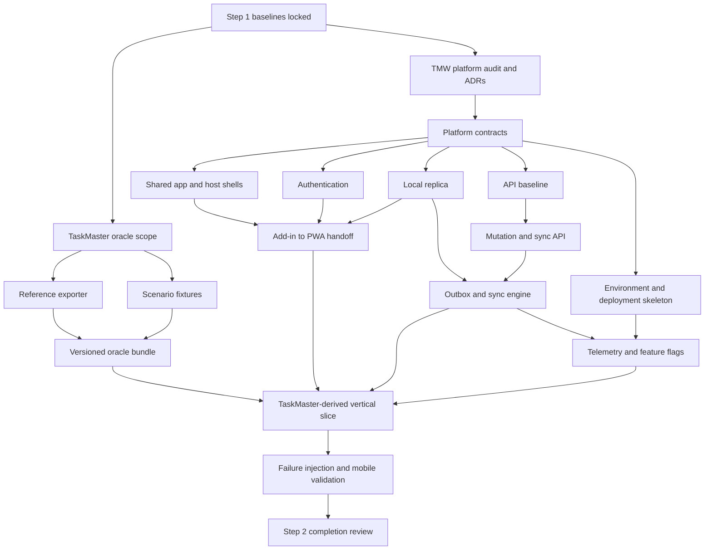

# Step 2 — Repository work, architecture, and sequencing

## Objective

Step 2 establishes the modern platform foundation and proves it with one TaskMaster-derived workflow. It is not the full feature migration.

The target product has three cooperating runtime surfaces:

- the Outlook web add-in for contextual online interaction;
- the installable companion PWA for full local-first and offline TaskMaster workflows; and
- the TaskMaster backend and Microsoft Graph data plane for authoritative mailbox operations and durable shared state.

TaskMaster VSTO supplies the pinned legacy oracle. TMW supplies the target implementation.

## Architectural invariant

> The companion PWA is the offline TaskMaster application. The Outlook add-in is the contextual Outlook integration.

The PWA should provide similar TaskMaster functionality offline for data within its synchronized scope. It can update its own local message and folder projection immediately and persist mailbox-affecting user intents. It cannot directly rewrite Outlook's private OST or Outlook-managed local cache through supported Office.js or Graph APIs.

After reconnection:

1. TMW submits the operation to its API.
2. The API applies it exactly once through Microsoft Graph.
3. The PWA reconciles the operation and folder-scoped delta state.
4. Outlook independently synchronizes the server-side change.

This is a strong local-first architecture. It is not a queue-only fallback.

## Step 2 entry gate

Step 2 begins only after the following are true:

- released Step 1 and Step 2 `drm-copilot` capabilities are pushed into both repositories;
- TaskMaster Step 1 discovery is merged;
- the TaskMaster source-baseline manifest is pinned and validates;
- TMW Step 1 parity reconciliation is merged;
- blocking product decisions are resolved;
- required online, offline, reconnect, desktop, Outlook Mobile, and companion-PWA outcomes are explicit;
- the selected foundation vertical slice has approved acceptance scenarios;
- baseline quality gates pass or pre-existing failures are recorded;
- required human-only dependencies have runbooks.

## Baseline manifest

Create a Step 2 baseline record containing:

```yaml
schemaVersion: 1

drmCopilot:
  version: "<released-version>"
  commit: "<commit-sha>"

taskMaster:
  repository: "drmoisan/TaskMaster"
  commit: "<step-1-merged-sha>"
  discoveryManifest: "<path>"
  discoveryChecksum: "<sha256>"

tmw:
  repository: "drmoisan/TMW"
  commit: "<step-1-merged-sha>"
  parityMatrix: "<path>"
  parityChecksum: "<sha256>"

platformFoundation:
  selectedVerticalSlice: "ifile"
  clientTopology: "outlook-addin-plus-local-first-pwa"
  authoritativeMailbox: "microsoft-365"
  offlineHost: "companion-pwa"
```

Do not use floating branches as source references.

## Cross-repository epics

Use two coordinated epics.

```text
TaskMaster epic: step2-legacy-oracle
TMW epic:        step2-platform-foundation
```

The TMW epic may read the pinned TaskMaster oracle. It must not write to TaskMaster or depend on TaskMaster production binaries.

## High-level dependency graph



## Wave 0 — decisions and foundation audit

### TaskMaster Wave 0

Create a Step 2 oracle scope document that identifies:

- pinned TaskMaster commit;
- selected feature contracts;
- selected runtime scenarios;
- required fixtures;
- required online/cached/reconnect behavior;
- privacy and redaction requirements;
- expected oracle bundle format;
- human characterization prerequisites.

No production behavior changes belong in this wave.

### TMW Wave 0

Audit the current platform and classify each component:

- retain unchanged;
- retain and harden;
- replace;
- migrate behind a new interface;
- prototype only;
- remove.

At minimum evaluate:

| Existing TMW component | Expected treatment |
|---|---|
| Office.js task pane | Retain; isolate behind host adapter |
| Outlook Mobile add-in-only manifest | Retain; add parity generation or validation |
| Unified/JSON manifest | Retain for supported desktop/web surfaces |
| TypeScript host-neutral iFile modules | Reuse where contracts remain valid |
| ASP.NET Core API | Retain and harden |
| Microsoft Identity Web and Graph OBO | Retain, productionize credentials and cache |
| Correlation middleware | Retain and extend into distributed tracing |
| OpenAPI | Retain, version, and check compatibility |
| iFile server workflow | Reuse as the vertical slice |
| In-memory feedback storage | Replace |
| JSON-file user settings | Development-only; replace for production |
| Dev Tunnels | Development-only |
| Current CI | Extend for PWA, deployment, security, migration, and offline tests |

### Mandatory ADRs

Approve these decisions before major implementation:

1. Client topology.
2. Shared application core and host-adapter boundaries.
3. Offline semantic contract.
4. Local replica scope and retention.
5. PWA storage technology and durability.
6. Authentication topology.
7. API versioning and command contract.
8. Idempotency and operation lifecycle.
9. Synchronization and conflict policy.
10. Portable classifier/model strategy.
11. Outlook add-in to PWA handoff.
12. Mobile support and manifest policy.
13. Telemetry and privacy.
14. Feature-flag provider and offline fallback.
15. Environment, deployment, data migration, and rollback.

## Wave 1 — TaskMaster legacy oracle

TaskMaster Step 2 is intentionally limited. It must not become part of the modern runtime.

### TM2-01 — Freeze the source baseline

Create an immutable oracle manifest with:

- repository identity;
- commit SHA;
- Step 1 contract checksums;
- selected scenarios;
- environment descriptions;
- build and test baseline;
- evidence roots;
- oracle version.

If legacy behavior changes later, publish a new oracle version.

### TM2-02 — Read-only reference exporter

Create a separate tooling or test-support project, not production add-in code.

Suggested shape:

```text
tools/
  TaskMaster.ReferenceExporter/

tests/
  TaskMaster.ReferenceExporter.Tests/
```

The exporter should produce deterministic, sanitized data including:

- folder hierarchy;
- folder names, paths, and relevant identities;
- message metadata;
- store and mailbox identity semantics;
- categories and flags;
- attachment metadata;
- classifier or recommendation outputs;
- settings relevant to selected scenarios;
- before and after state;
- expected outcomes;
- errors and partial-failure states.

It must not export real message bodies, email addresses, tokens, tenant IDs, or personal paths unless explicitly synthesized and approved.

### TM2-03 — Scenario fixture pack

For an iFile foundation slice, include scenarios equivalent to:

```text
TM-FILING-ONLINE-001
TM-FILING-CACHED-OFFLINE-001
TM-FILING-RECONNECT-001
TM-FILING-OUTLOOK-RESTART-001
TM-FILING-DESTINATION-RENAMED-001
TM-FILING-MESSAGE-MOVED-REMOTELY-001
TM-FILING-DUPLICATE-REQUEST-001
TM-FILING-PARTIAL-ATTACHMENT-FAILURE-001
TM-FILING-CONVERSATION-001
TM-FILING-UNDO-001
```

Each scenario contains:

- environment;
- sanitized fixture;
- pre-state;
- action;
- legacy result;
- post-state;
- ordering;
- user feedback;
- evidence;
- required target result;
- approved semantic differences.

Step 2 packages Step 1 knowledge into deterministic fixtures; it does not rediscover the application.

### TM2-04 — Runtime characterization evidence

Run the selected scenarios against a safe classic Outlook profile and record:

- Outlook version and bitness;
- account and store type;
- cached-mode state;
- network state;
- result;
- timing;
- restart behavior;
- reconnect behavior;
- sanitized logs;
- repeatability.

Manual dependencies require runbooks and explicit evidence.

### TM2-05 — Versioned oracle bundle

Publish a bundle such as:

```text
artifacts/platform-foundation/
  taskmaster-oracle-v1/
    manifest.json
    contracts/
    fixtures/
    expected-results/
    environment/
    checksums.json
```

TMW tests consume the pinned bundle or its source files by immutable commit and checksum.

### TaskMaster stability rules

During TMW foundation development:

- keep the legacy build and MSTest baseline green;
- do not refactor selected behavior;
- do not add modern auth, APIs, PWA code, sync, flags, or telemetry;
- do not change a contract to make TMW implementation easier;
- publish a new oracle version for genuine legacy changes.

## Wave 2 — TMW platform contracts

Create one contract-first TMW feature before parallel implementation.

### TMW2-01 — Shared platform contracts

Define and validate interfaces equivalent to:

```typescript
interface HostContext
interface HostCapabilityProvider
interface ConnectivityMonitor
interface LocalStore
interface LocalReplicaRepository
interface ModelSnapshotStore
interface MutationOutbox
interface SyncCoordinator
interface ConflictRepository
interface TokenBroker
interface ApiClient
interface TelemetrySink
interface FeatureFlagProvider
interface Clock
interface OperationIdProvider
interface HandoffClient
```

Server-side equivalents:

```csharp
public interface ICurrentUser;
public interface IOperationRepository;
public interface IIdempotencyStore;
public interface ISyncCursorRepository;
public interface IConflictResolver;
public interface IGraphMailboxAdapter;
public interface IModelSnapshotRepository;
public interface IFeatureFlagEvaluator;
```

This wave should establish schemas, interfaces, generated contracts, architecture tests, and fixtures. It should contain little product behavior.

### Required environment contract

At minimum:

```text
Environment name
Release/build version
Add-in base URL
PWA base URL
API base URL
Tenant/application identifiers
Authority and audience
Telemetry endpoint
Feature-flag endpoint
Database connection reference
Local schema version
Sync protocol version
Model protocol version
Deployment region
```

Every client and service must expose release and schema versions in diagnostics.

## Wave 3 — parallel TMW foundation implementation

After platform contracts merge, use isolated worktrees.

### TMW2-02 — Shared application core and host shells

Recommended shape:

```text
src/
  core/
    domain/
    application/
    filing/
    classifiers/
    tasks/
    tags/

  platform/
    auth/
    local-store/
    sync/
    telemetry/
    feature-flags/

  hosts/
    outlook-addin/
      desktop-web/
      mobile/
      handoff/

    companion-pwa/
      shell/
      service-worker/
      install/
      offline-readiness/

  ui/
    shared/
    responsive/
```

Deliver:

- shared routing and state model;
- no Office.js dependency in core modules;
- desktop/web add-in bootstrap;
- Outlook Mobile add-in bootstrap;
- PWA bootstrap;
- service-worker cache;
- installability;
- connectivity and offline status;
- account/mailbox boundary;
- error boundary;
- update and schema compatibility UX;
- shared components where appropriate;
- host-specific adapters only at boundaries.

### TMW2-03 — Authentication foundation

Deliver:

- add-in token broker;
- PWA sign-in;
- authenticated API client;
- API bearer validation;
- Graph on-behalf-of path;
- explicit authorization policies;
- scope validation;
- consent and conditional-access errors;
- expired and revoked tokens;
- logout and account switching;
- production credential and token-cache strategy;
- test identity provider;
- no token logging;
- no access tokens in the local domain database.

Test:

- valid and absent token;
- wrong audience;
- wrong tenant where applicable;
- missing scope;
- expired token;
- revoked consent;
- Graph OBO failure;
- multiple accounts;
- local sign-out purge;
- telemetry redaction.

### TMW2-04 — Versioned API and durable operation contract

Deliver:

- explicit API versioning;
- standard error envelope;
- trace and correlation identifiers;
- idempotency keys;
- optimistic concurrency;
- cancellation;
- pagination and continuation;
- health, readiness, and capabilities endpoints;
- generated OpenAPI;
- generated TypeScript client;
- breaking-change checks;
- durable operation persistence;
- production persistence abstraction.

Foundation endpoints may include:

```text
POST /api/v1/handoffs
POST /api/v1/operations
GET  /api/v1/operations/{operationId}
POST /api/v1/sync/push
GET  /api/v1/sync/pull?cursor=...
GET  /api/v1/models
GET  /api/v1/capabilities
```

Existing iFile and classification endpoints may remain temporarily but must migrate behind the versioned contracts.

### TMW2-05 — Local replica and storage

Conduct a real technology spike on every supported host.

Verify:

- IndexedDB availability;
- service-worker support;
- transaction semantics;
- quota and estimation;
- persistence request behavior;
- schema migration;
- private/restricted modes;
- performance;
- deletion and sign-out purge;
- mobile behavior;
- test automation.

Minimum local entities:

```text
Account
Mailbox
Folder
CachedMessage
CachedAttachmentMetadata
TaskMasterTag
TaskMetadata
UserSettings
ModelSnapshot
PendingOperation
OperationAttempt
SyncCursor
Conflict
FeatureFlagSnapshot
TelemetryEnvelope
SchemaMetadata
```

Required behavior:

- partition by tenant, user, and mailbox;
- explicit schema version;
- forward migrations;
- atomic optimistic update and outbox creation;
- bounded cache;
- retention;
- storage-health reporting;
- persistence request;
- corruption recovery;
- sign-out purge;
- no secrets;
- deterministic test repository.

### TMW2-06 — Development, environment, and deployment skeleton

Deliver:

- one-command local bootstrap;
- API, PWA, add-in, and dependency startup;
- environment validation;
- test identity;
- local telemetry sink;
- local flag provider;
- development persistence;
- infrastructure-as-code skeleton;
- development/test/staging/production definitions;
- external secret store;
- static PWA/add-in hosting;
- API hosting;
- database provisioning;
- controlled migrations;
- artifact versioning;
- rollback;
- dependency and secret scanning;
- deployed smoke workflow.

Deployability must be exercised during Step 2, not deferred.

## Wave 4 — synchronization and cross-cutting services

### TMW2-07 — Mutation outbox and synchronization engine

A pending operation should contain:

```yaml
operationId: "<uuid>"
idempotencyKey: "<stable-key>"
type: "file-message"
tenantId: "<partition>"
userId: "<partition>"
mailboxId: "<partition>"
payload: {}
precondition:
  entityVersion: "<optional>"
createdAt: "<timestamp>"
attemptCount: 0
state: "pending"
lastError: null
```

Required lifecycle:

```text
pending
  -> sending
  -> acknowledged
  -> completed

pending/sending
  -> retryable-failure
  -> pending

pending/sending
  -> conflict

pending/sending
  -> permanent-failure

pending
  -> cancelled
```

Required guarantees:

- restart survival;
- deterministic replay;
- stable idempotency;
- bounded exponential retry;
- safe ambiguous-response handling;
- no duplicate side effects;
- account/mailbox isolation;
- server acknowledgement before deletion;
- tombstones;
- folder-scoped delta cursors;
- user-visible pending, failure, and conflict states;
- foreground sync correctness;
- background sync only as an optimization.

### TMW2-08 — Add-in to PWA handoff

Implement an explicit API-mediated handoff.

```text
Outlook add-in
  -> POST /api/v1/handoffs
  -> short-lived single-use token
  -> HTTPS app link
  -> installed PWA or browser fallback
  -> token redemption
  -> normalized local record
  -> token invalidated
```

Do not place sensitive message data or credentials in URLs. Do not rely on the add-in and installed PWA sharing IndexedDB.

Support:

- Open in TaskMaster;
- Save for offline;
- Add to work queue;
- File in TaskMaster;
- Create task from message;
- Classify in TaskMaster.

### TMW2-09 — Portable classifier and model snapshots

For strong offline parity, at least one selected inference path must run locally.

Evaluate:

- TypeScript implementation;
- WebAssembly;
- portable model format;
- synchronized rules/model package;
- hybrid local inference with server consolidation.

Model package fields include:

```yaml
modelId: "folder-predictor"
version: 1
format: "taskmaster-portable-v1"
featureSchemaVersion: 1
checksum: "<sha256>"
downloadedAt: "<timestamp>"
```

The PWA should:

- classify cached data offline;
- produce folder recommendations;
- accept feedback;
- queue training examples;
- reconcile a newer server model;
- reject incompatible feature/model versions safely.

### TMW2-10 — Telemetry and diagnostics

Deliver:

- stable event catalog;
- structured logs;
- distributed traces;
- metrics;
- client, API, operation, and Graph correlation;
- environment and release identity;
- PII classification and redaction;
- sampling;
- bounded offline telemetry buffer;
- retry and drop rules;
- support diagnostic export;
- health dashboards and alert ownership.

Events include:

```text
application_started
host_detected
authentication_started
authentication_succeeded
authentication_failed
local_store_opened
local_store_migrated
model_loaded
handoff_created
handoff_redeemed
operation_queued
sync_started
operation_sent
operation_completed
operation_conflicted
sync_failed
feature_flag_evaluated
```

Do not log subjects, bodies, addresses, tokens, attachment names, or raw IDs unless separately approved and protected.

### TMW2-11 — Feature flags

Provide:

- provider-neutral interface;
- deterministic local provider;
- production adapter;
- cached snapshot;
- safe online and offline defaults;
- owner;
- purpose;
- expiry;
- cleanup issue;
- telemetry;
- kill switch;
- environment targeting.

Feature flags never authorize access.

Initial flags may include:

```text
platform.companion-enabled
platform.local-store-enabled
platform.sync-enabled
platform.offline-mutations-enabled
platform.telemetry-upload-enabled
platform.ifile-v2-enabled
```

## Wave 5 — integrated TaskMaster-derived proof

### Recommended vertical slice: iFile

TMW already has useful iFile code and Graph operations. Use it to prove the entire platform rather than creating an artificial sample.

### Online add-in path

1. Open TMW in Outlook.
2. Authenticate.
3. Identify the selected message.
4. Load cached folders immediately where available.
5. Refresh through the API.
6. select a destination;
7. submit an idempotent filing operation;
8. apply through Graph;
9. display completion;
10. correlate telemetry.

### Offline desktop PWA path

1. Install and initially synchronize the PWA.
2. Receive or select a message in the offline scope.
3. Disconnect.
4. launch the PWA independently;
5. browse and search local folders;
6. produce a local recommendation;
7. choose a destination;
8. atomically update the projection and outbox;
9. show pending state;
10. close and restart the PWA;
11. verify state survival;
12. inspect or undo where allowed;
13. reconnect;
14. synchronize;
15. apply exactly once;
16. reconcile Graph delta;
17. clear pending state;
18. confirm Outlook later converges.

### Mobile path

1. Install the PWA on an iOS or Android target device.
2. Sign in and synchronize.
3. Open a message in Outlook Mobile.
4. Launch the TaskMaster mobile add-in.
5. select Open in TaskMaster or Save for offline;
6. redeem the handoff in the PWA;
7. enter airplane mode;
8. close Outlook;
9. open the PWA from the home screen;
10. find the cached message;
11. classify or recommend locally;
12. file to a cached destination;
13. verify optimistic local state;
14. force-close and reopen;
15. verify pending state;
16. restore connectivity;
17. foreground the PWA;
18. synchronize exactly once;
19. reconcile delta;
20. open Outlook Mobile;
21. verify Outlook displays the result after mailbox sync;
22. verify end-to-end telemetry.

### Conflict and failure cases

At minimum:

- API timeout before acknowledgement;
- ambiguous response after server commit;
- duplicate submission;
- message moved remotely;
- message deleted remotely;
- destination renamed;
- destination deleted;
- permissions revoked;
- account switched;
- local schema upgrade with pending operation;
- storage quota failure;
- telemetry provider unavailable;
- feature-flag provider unavailable;
- model incompatibility;
- PWA update during pending work.

## Mobile-specific product behavior

### Outlook Mobile add-in

Keep the mobile add-in fast:

- selected-message context;
- current TaskMaster status;
- a few immediate online actions;
- Save for offline;
- Open in TaskMaster;
- clear success/failure;
- clean close behavior.

Do not overload it with the complete application.

### Companion mobile PWA

Provide:

```text
TaskMaster
  Work Queue
  Cached Messages
  Pending Sync
  Conflicts
  Tasks
  Tags
  Folders
  Classifier Feedback
  Settings
  Offline Readiness
```

### Mobile synchronization

Correctness depends on synchronization when:

- the PWA launches;
- it returns to foreground;
- connectivity returns;
- the user selects Sync now.

Background sync, periodic sync, and push notifications are optional optimizations.

### Mobile storage

The PWA must:

- request persistent storage;
- report whether it was granted;
- estimate quota;
- bound cache size;
- protect outbox integrity;
- reconstruct server-derived cache;
- purge safely at sign-out;
- warn when offline durability is degraded.

If approved requirements later demand stronger storage guarantees than a PWA provides on a platform, a native wrapper may package the same core. That does not change the Outlook integration architecture.

## Recommended pull-request sequence

### TaskMaster

```text
TM2-01 docs: freeze Step 1 source baseline
TM2-02 tooling: add sanitized reference exporter
TM2-03 test: add platform-foundation scenario fixtures
TM2-04 evidence: characterize cached-mode and reconnect behavior
TM2-05 chore: publish versioned legacy oracle bundle
```

Dependencies:

```text
TM2-01
  -> TM2-02
  -> TM2-03
TM2-02 + TM2-03
  -> TM2-04
TM2-04
  -> TM2-05
```

### TMW

```text
TMW2-01 docs: platform audit and ADRs
TMW2-02 feat: shared platform contracts

Wave A after TMW2-02:
TMW2-03 feat: shared core and host shells
TMW2-04 feat: authentication foundation
TMW2-05 feat: versioned API and durable operations
TMW2-06 feat: local replica and storage
TMW2-07 chore: environment and deployment skeleton

Wave B:
TMW2-08 feat: mutation outbox and sync
TMW2-09 feat: add-in to PWA handoff
TMW2-10 feat: portable local model
TMW2-11 feat: telemetry and diagnostics
TMW2-12 feat: feature flags

Wave C:
TMW2-13 feat: iFile online/offline/mobile vertical slice
TMW2-14 test: failure injection and cross-platform verification
TMW2-15 docs: operations, rollback, completion, and handoff
```

Use an epic integration branch. Do not merge incomplete foundation fragments directly to `main`.

## Four-week planning shape

The original four-week estimate is plausible only for foundation plus one vertical slice.

| Week | TaskMaster | TMW |
|---|---|---|
| 1 | Freeze baseline; define fixtures | Audit, ADRs, platform contracts |
| 2 | Reference exporter and scenario pack | Shells, auth, API, local replica, environment skeleton |
| 3 | Characterization and oracle bundle | Sync, handoff, local model, telemetry, flags |
| 4 | Support comparison | iFile vertical slice, mobile/offline validation, completion review |

Human dependencies must be identified in Week 1:

- Entra app registrations and consent;
- development and staging tenants;
- physical mobile devices;
- supported Outlook versions;
- safe test mailbox;
- trusted HTTPS hosting;
- cloud permissions;
- certificates and secret stores;
- browser/PWA installation permissions.

## TaskMaster Step 2 completion gate

TaskMaster support work passes only when:

- source baseline is pinned;
- oracle artifacts are reproducible;
- fixtures are sanitized;
- selected scenarios have evidence;
- cached-mode and reconnect behavior is characterized;
- checksums validate;
- production behavior remains unchanged;
- legacy build and tests pass;
- TMW can consume the bundle without a personal mailbox.

## TMW Step 2 completion gate

### Shell and host boundaries

- Outlook desktop/web add-in launches.
- Outlook Mobile add-in launches online.
- PWA installs and launches offline.
- Shared core contains no Office.js dependency.
- Host capability detection is explicit.
- Add-in and PWA use an explicit handoff.

### Authentication

- Add-in and PWA authenticate.
- API validates identity and authorization.
- Graph access works.
- consent, expiry, revocation, and account switching are tested;
- tokens are not logged or stored in the domain cache.

### API and persistence

- API is versioned.
- OpenAPI is generated and compatibility checked.
- errors, correlation, idempotency, and concurrency are defined;
- health and readiness are separate;
- operation state is durable;
- production persistence and migrations exist.

### Local replica

- offline data is useful, not merely opaque queue records;
- schema migrations work;
- data survives restart;
- tenant/user/mailbox partitions are isolated;
- cache is bounded;
- storage health is visible;
- corruption and purge are defined;
- at least one classifier/recommendation path runs locally.

### Synchronization

- an offline action survives restart;
- replay is deterministic;
- duplicate submission is harmless;
- ambiguous responses are safe;
- delta cursors advance;
- conflicts are visible;
- Outlook converges after server synchronization.

### Telemetry and flags

- client and server traces correlate;
- PII rules are tested;
- offline telemetry buffering works;
- feature flags have owners, offline defaults, expiry, and cleanup;
- provider failure results in safe behavior;
- flags do not authorize.

### Deployment and rollback

- a clean environment can be provisioned;
- deployment is automated;
- secrets are external;
- migrations are controlled;
- rollback and kill switch are tested;
- deployed smoke tests run.

### Integrated proof

- the TaskMaster oracle comparison passes or has an approved semantic difference;
- desktop online works;
- desktop PWA offline, restart, and reconnect work;
- Outlook Mobile contextual handoff works;
- mobile PWA offline and foreground reconnect work;
- operation is applied exactly once;
- telemetry links the complete journey;
- parity matrix is updated with verified status.

## Explicit non-goals

Do not:

- add modern product components to TaskMaster;
- make TMW depend on TaskMaster binaries;
- treat PWA local storage as Outlook's native cache;
- attempt direct OST modification;
- claim the Outlook add-in runs offline;
- reduce the companion PWA to an outbox UI;
- claim mobile parity because the task pane opens;
- store access tokens in IndexedDB;
- implement sync without API idempotency;
- depend on background sync for correctness;
- defer telemetry and deployment until after feature work;
- migrate broad features before the vertical slice passes;
- change legacy contracts silently.

## Handoff to later migration steps

Step 2 should leave:

- reusable host and domain boundaries;
- a deployable add-in, PWA, API, and database skeleton;
- authenticated and observable end-to-end communication;
- a versioned local schema;
- a working outbox and sync protocol;
- a portable model path;
- feature flags and rollback;
- a validated TaskMaster oracle;
- one complete iFile vertical slice;
- an updated dependency-aware parity backlog.

Only then should broad iFile parity, tags, tasks, classifiers, analytics, and VSTO retirement proceed.
